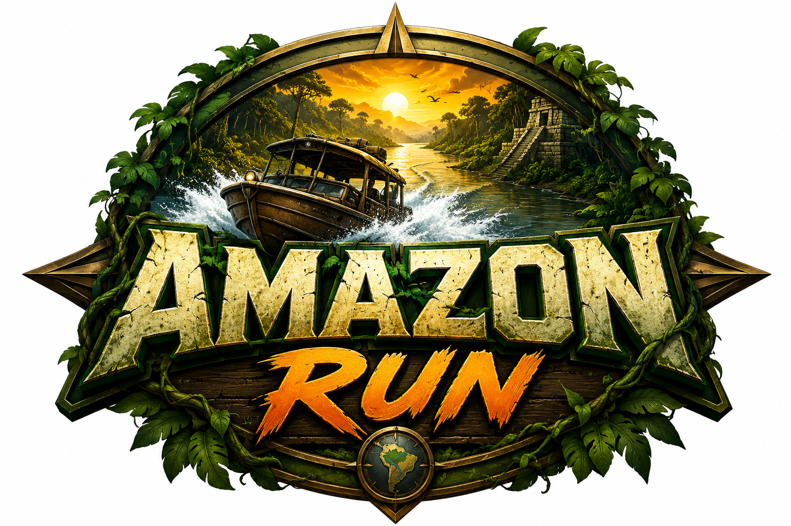

  

# Amazon Run

A stylized 3D river adventure inspired by the Amazon rainforest.

Pilot a small river boat deep into the jungle, deliver critical supplies to remote outposts, avoid natural hazards, and explore ancient ruins hidden along the riverbanks.

Built entirely as a browser-based experience using Three.js and designed to run on GitHub Pages with no server requirements.

---

## Features

### 🌴 Amazon Jungle Environment

- Dense jungle riverbanks
- Ancient stone ruins
- Dynamic fog and atmospheric lighting
- Birds and wildlife
- River reflections and water effects
- Scenic exploration-focused gameplay

### 🚤 River Boat Gameplay

- Third-person boat camera
- Stylized cargo boat inspired by Amazon river transport
- Engine boost system
- Smooth steering controls
- Mobile and desktop support

### 📦 Mission System

- Deliver supply crates to remote outposts
- Progress through multiple jungle sectors
- Increasing environmental challenges
- Exploration-focused pacing

### ⚠️ River Hazards

- Floating logs
- River rocks
- Narrow river passages
- Environmental obstacles

Designed to challenge the player without overwhelming them.

### 🖥 User Interface

- Amazon Run logo branding
- Mission tracker
- Distance counter
- Speed indicator
- Zone information
- Hamburger menu
- Fullscreen toggle
- Reset View option
- Restart Mission option

### 📱 Mobile Friendly

- Touch controls
- Fullscreen support
- Pinch-zoom prevention
- Responsive interface

---

## Controls

| Key | Action |
|------|---------|
| W | Accelerate |
| S | Slow / Reverse |
| A | Steer Left |
| D | Steer Right |
| Arrow Keys | Alternative Controls |
| Space | Engine Boost |

### Mobile

- Left Control Pad: Steering
- Boost Button: Engine Boost

---

## Fullscreen Mode

The game attempts to enter fullscreen when the mission begins.

If fullscreen is not enabled automatically:

1. Open the hamburger menu in the upper-left corner.
2. Select **Toggle Fullscreen**.

---

## GitHub Pages Deployment

Upload the following files to the root of your repository:

- index.html
- amazon-run-logo.png
- README.md

Enable GitHub Pages:

1. Open your repository.
2. Go to **Settings** → **Pages**.
3. Select your main branch.
4. Set the source folder to `/ (root)`.
5. Save.

GitHub will publish the game automatically.

---

## Technology

- Three.js
- JavaScript
- HTML5
- CSS3
- WebGL

No backend services required.

---

## Roadmap

- Improved low-poly boat model
- Better water shader
- River docking system
- Village delivery locations
- Smuggler encounters
- Wildlife interactions
- Dynamic weather
- Day/night cycle
- Save game support
- Additional river regions

---

## Developer

Amazon Run was created by **David Fliesen**, a retired U.S. Navy Chief Journalist, multimedia designer, animator, and Generative AI developer. The project combines a passion for interactive storytelling, game design, emerging technology, and immersive experiences inspired by the natural world.

GitHub: https://github.com/davidfliesen

Portfolio: https://davidfliesen.github.io/
